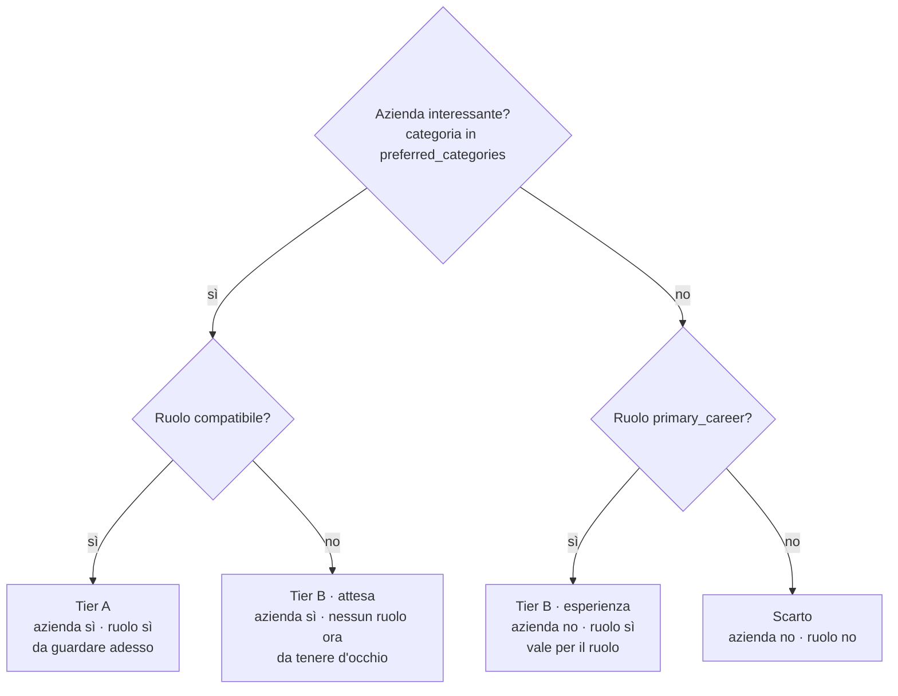

# JobHunter — architettura

Documento di riferimento per la pipeline. Le decisioni qui dentro sono state prese
nella sessione di revisione del **9 settembre 2026** e sostituiscono l'impianto
precedente, in cui l'annuncio era l'unità di lavoro e l'azienda solo un raggruppamento.

I campi, uno per uno, sono in [`docs/data-model.md`](docs/data-model.md).

I numeri citati sono misurati sull'archivio a quella data (5.908 aziende, 23.049
annunci). Servono a spiegare **perché** una scelta è stata fatta: vanno rimisurati
prima di usarli per decidere altro, non fidarsi a distanza di mesi.

---

## 1. Le due intenzioni

Il tool serve a due cose che **non coincidono**:

- **scoprire aziende interessanti**, a prescindere da chi stia assumendo adesso;
- **trovare annunci compatibili** con il profilo del candidato.

Un'azienda può interessare senza avere posizioni aperte. Una posizione può essere
adatta in un'azienda che non interessa. L'errore da non ripetere è **lasciare che il
filtro sui ruoli decida la visibilità dell'azienda**: al 9 settembre 2026 questo
rendeva invisibili **2.070 aziende su 5.908**, non perché giudicate poco
interessanti ma perché nessuno le aveva guardate.

## 2. Due assi indipendenti, quattro esiti

I due assi si valutano **separatamente**. Nessuno dei due può cancellare l'altro.

- **Asse azienda** — «l'azienda è interessante?» equivale a **«la sua categoria è
  fra quelle preferite?»** (`config/role_filters.json → preferred_categories`,
  vocabolario in `config/categories.json`). Non è un giudizio a sé: **categorizzare
  l'azienda *è* valutare l'asse.**
- **Asse ruolo** — «esiste un ruolo adatto?», con **due soglie diverse**:
  - azienda interessante → basta un ruolo compatibile;
  - azienda non interessante → solo `primary_career`, cioè `primary_title_pattern`.
    Il ruolo deve valere la pena da solo, altrimenti il Tier B si riempie di ruoli
    mediocri in aziende che non interessano.



Un quinto stato, **`evidenza mancante`**, vale quando l'asse azienda non è
valutabile per assenza di dati. **Non è un verdetto: è una coda di lavoro.**
L'assenza di prove non è mai un rifiuto. Al 9 settembre 2026 riguardava 2.148
aziende, il 99% delle quali non aveva mai avuto un tentativo di recupero
descrizione: arretrato, non muro.

### Il tier non si salva mai

Si salvano i **due verdetti d'asse** e le decisioni dell'utente. **Il tier è una
funzione di questi, calcolata al momento della lettura.** Persistere il tier
ricrea il bug originale: un'azienda a «scarto» non risalirebbe mai a Tier B quando
pubblica un ruolo adatto.

Tier A e Tier B **non condividono la stessa coda**: un annuncio scade, l'interesse
per un'azienda no. Tier A è «cosa guardo questa settimana», Tier B è una mappa
senza urgenza.

## 3. Tre giudici in cascata

Ogni giudice lavora **solo su ciò che il precedente non ha saputo decidere**.

| # | giudice | mestiere | esiti | costo misurato |
|---|---------|----------|-------|----------------|
| 1 | **Regex** | solo esclusioni **certe**: senior, manager, HR, mansioni fuori perimetro | escluso · passa | nullo |
| 2 | **System One** (Jev) | **i «non so»** di entrambi gli assi, senza generare testo: decide il ruolo e assegna il settore | tieni · scarta · non so | 0,042 $/MTok in ingresso, uscita gratuita; **una passata sull'archivio ≈ 1,20 $** |
| 3 | **L'utente**, in chat | i «non so» che restano; risponde alle domande dell'agente; scelta finale per azienda | preferenza · decisione | tempo umano |

### Il livello di revisione sopra la cascata (22 settembre 2026)

La cascata automatica si ferma al primo giudice che decide. Sopra di lei, sul singolo ruolo,
stanno due giudici che la **sovrascrivono** senza cancellarla. L'ordine, dal più forte, è
**utente → agente → Jev → regex**.

- **Utente:** l'ultima decisione non annullata sul ruolo in `feedback`. `saved` vale tieni,
  `discarded` vale scarta, gli altri stati sono informativi. Non scade mai.
- **Agente:** Codex o Claude in una sessione `regole` (`enrichments`, task `agent:selection`).
  Lavora sugli indecisi di Jev e sui ruoli compatibili di Tier A/B, e ogni verdetto cita
  almeno una regola che l'utente ha confermato in `user_context/selection/regole.md`. Conta
  finché il testo dell'annuncio e quello delle regole citate restano identici.

La catena conserva tutti i verdetti: cambia solo quale conta. Tier, schede Qwen e sessioni
leggono il verdetto finale, quindi seguono da soli. Codice: `jobhunter/evaluation/review.py`,
`tier.role_verdict(chain, overrides)`. Questo supera la regola dell'11 settembre per cui una
scelta manuale restava accanto ai verdetti senza cambiarli: la tab «Salvate» resta separata e
contiene solo quello che salvi tu.

Scelta del ruolo e categoria aziendale sono domande indipendenti ma condividono la stessa
richiesta Jev quando entrambe sono pendenti. Il codice salva i due risultati con impronte separate.

**Il regex marca, non elimina.** È la condizione perché i passi successivi possano
ignorarlo quando serve (vedi §4).

Il regex può soltanto produrre uno scarto certo. Un titolo nella famiglia preferita conserva
la priorità di carriera, ma resta `non so` sull'asse ruolo: tutti i non scartati con mansioni
leggibili passano a Jev, che è l'unico giudice semantico automatico.

**Il modello remoto non è più un giudice.** Dal 20 settembre 2026 Qwen fa una cosa sola:
scrivere le schede dei ruoli sopravvissuti e la scheda dell'azienda. Non decide se un
annuncio si tiene e non assegna categorie. Il confine non è il prezzo, è il mestiere: **chi
decide non scrive, chi scrive non decide.** Un System One model non genera stringhe, quindi
un giudizio mancante o una citazione inventata non sono possibili — erano i due modi in cui
il batch remoto buttava via le risposte — ma un riassunto nemmeno. Dettagli, soglie e limiti
in [docs/system-one.md](docs/system-one.md).

Conseguenza da tenere presente: **quello che System One lascia indeciso resta indeciso.**
Nessun modello lo rivede; è materiale per te, in chat o nella dashboard. È una scelta, non
una dimenticanza: pagare un secondo giudizio su un caso già ambiguo non lo rende meno ambiguo.

L'asse azienda è invece multi-etichetta: Jev usa probabilità indipendenti per settore e conserva al
massimo due categorie affidabili. Gli indecisi
sui ruoli e le aziende senza categorie affidabili alimentano la revisione guidata da Codex.
Dettagli e soglie in [docs/pipeline-completa.md](docs/pipeline-completa.md) e
[docs/conversazioni-codex.md](docs/conversazioni-codex.md).

Il livello 2 va speso **dove il primo ha fallito**, mai prima. La sintesi e l'impaginazione
si fanno **dopo** l'assegnazione del tier e **solo su Tier A e B**: riscrivere la scheda di
un'azienda che poi si scarta è lavoro pagato e buttato.

### Il giudice locale è stato rimosso il 10 settembre 2026

Fra il regex e il remoto c'era un modello su Ollama (`qwen3.5:4b`) che categorizzava le
aziende e giudicava i ruoli. Tolto, con le misure che lo hanno deciso:

- **0 ruoli decisi su 4.918 giudicabili.** Non alleggeriva il conto del remoto di un solo
  annuncio: quei ruoli il remoto li riceveva comunque tutti.
- Su un campione di 27 annunci non ha prodotto **nessun** `keep`: solo `exclude` e `review`.
- Raggruppare azienda e annunci in una chiamata sola per accorciare i tempi **peggiora**:
  più lento del 12%, 8 citazioni inventate su 27, e i «non so» diventano «scarta» — falsi
  negativi generati dal formato della domanda, non dal contenuto.
- Il remoto fa lo stesso lavoro **dentro una chiamata che si paga comunque**, una per azienda.

Resta un solo classificatore gratuito prima del remoto: le **regole a parole chiave** su
settore e descrizione (`config/categories.json`), che coprono ~1.100 aziende senza
chiamare nessun modello.

Il livello 4 non gira dentro il tool: l'utente lavora in chat con un agente che
legge i Tier A e B e propone domande mirate a produrre scarti o cambi di tier.
`jobhunter/interview.py` fa già questo raggruppamento per pattern; va esteso ai due
assi e ai tier, invece di lavorare solo sugli annunci in stato `review`.

## 4. Ordine dei passi

```mermaid
flowchart LR
    C["1 · Raccolta<br/>normalizza, raggruppa"] --> G["2 · Regex sui ruoli<br/>marca, non elimina"]
    G --> D["3 · Descrizioni<br/>mirate sulla copertura aziendale"]
    D --> E["4 · Dati aziendali<br/>scheda, sito, annuncio"]
    E --> R["5 · Regole a parole chiave<br/>gratis, solo certezze"]
    R --> J["6 · System One<br/>i non so, le categorie"]
    J --> T["7 · Tier<br/>calcolato, mai salvato"]
    T --> Q["8 · LLM remoto<br/>solo le schede, su Tier A e B"]
    Q --> H["9 · Agente in chat<br/>domande, preferenze"]
    H --> U["10 · Scelta manuale<br/>non genera regole"]
```



**Il passo 3 non risponde mai ai filtri sui ruoli: risponde alla copertura
aziendale.** Regola: *almeno un annuncio scaricato per ogni azienda priva di
evidenza propria*, qualunque cosa il regex pensi di quei ruoli.

Motivo, misurato: 2.070 aziende hanno tutti i ruoli tagliati dal regex, e **1.505
di queste non hanno evidenza propria**. Subordinare il recupero ai filtri sui ruoli
le renderebbe invisibili per costruzione — lo stesso bug di §1, spostato a monte.

## 5. Estrazione dell'evidenza aziendale

La pagina di un annuncio contiene sia il ruolo sia il «chi siamo». Vanno separati,
e si applica **lo stesso principio della cascata**: prima ciò che è gratis e certo,
poi ciò che costa. Coperture misurate il 9 settembre 2026:

| leva | copertura | resa |
|------|-----------|------|
| `hiringOrganization.sameAs` dal JSON-LD → **sito aziendale** | 75% delle pagine | l'indirizzo, non il testo |
| **Intersezione fra annunci della stessa azienda** | 1.286 aziende hanno ≥2 testi; 65% di queste dà un blocco comune | mediana **1.517 caratteri** |
| Split per intestazione «About us / Chi siamo» | 13% | debole ma gratis |
| Residuo | il resto | **LLM remoto**, dentro la chiamata per azienda che si paga comunque |

`hiringOrganization.description` **non esiste** nel corpus (0 occorrenze su 600
pagine campionate): non usarlo come fonte.

Il principio dell'intersezione: **il testo identico che si ripete su più annunci
della stessa azienda è per definizione boilerplate aziendale, non descrizione del
ruolo.** Nessun modello, nessuna euristica fragile.

## 6. Dove atterrano le preferenze

`jobhunter/remote_llm.py → inputs()` inserisce **il testo integrale** del profilo
(`user_context/llm-selection-profile.md`) nel payload, e `current_result()` calcola
la chiave di cache su quel payload. **Conseguenza: modificare un carattere del
profilo invalida ogni giudizio remoto già pagato.**

Per questo le preferenze raccolte dall'agente hanno due destinazioni distinte:

- **Nei giudici economici** (liste in `preferred_categories`, regex sui titoli) —
  quando la preferenza è esprimibile come regola. **Nessuna invalidazione**: i
  giudizi LLM restano validi e la regola li filtra a valle. *È la destinazione
  predefinita.*
- **Nel profilo che va al modello** — solo quando la preferenza è irriducibilmente
  semantica. Queste si **accumulano** e si applicano in una passata sola, mai una
  alla volta: ogni modifica del profilo vale un giro completo.

Ne discende una proprietà voluta: **le risposte dell'utente istruiscono i giudici
economici, non quello caro.** Più il tool viene usato, più regex e liste tagliano,
meno lavoro vede l'API. Il sistema diventa più economico con l'uso.

**La scelta manuale sulla singola azienda non genera mai regole per aziende
future**: è troppo specifica per generalizzare. Vale per quel record e basta.

Il feedback va chiesto **sul pattern, non sul record**. Un giudizio su una
categoria sposta centinaia di aziende; uno su un record ne sposta uno su 5.908 —
ed è il motivo per cui il vecchio meccanismo di proposte automatiche non ha mai
prodotto nulla (`preference_rules` è rimasta vuota).

## 7. Provenienza della classificazione

Per ogni record deve restare scritto **quale giudice ha deciso cosa e perché**.
I dati esistono già, sparsi:

| dove | asse | giudice | cosa conserva |
|------|------|---------|---------------|
| `search_eligibility.decision` | ruolo | regex | `reasons`, requisiti, verifiche |
| `enrichments` (`jev:selection`) | ruolo | Jev | `rationale` + citazione verificata |
| `categories` (`method`, `reason`) | azienda | tutti | categoria + provenienza |
| *(da aggiungere)* | entrambi | utente | commento sulla scheda |

**Non unificare le tabelle.** Visto che il tier si calcola a lettura (§2), la stessa
funzione che lo calcola assembla la catena delle motivazioni. La forma unica serve
in uscita, non in archivio.

## 8. Contratto per una fonte nuova

Una fonte nuova si aggiunge in `config/app.json → sources` con un `kind` e un file
di configurazione. Perché la pipeline funzioni, deve rispettare questo contratto.

**Campi obbligatori per riga** (`jobhunter/workspace.py → normalize()` rifiuta la
riga se mancano):

- `company_name` — il raggruppamento per azienda dipende da questo;
- `title`;
- un singolo URL HTTP fra `source_url` / `job_url` / `url` / `original_url`.

**Campi che alimentano l'asse azienda** — senza questi la fonte produce aziende in
stato `evidenza mancante`, recuperabile ma al costo di un fetch per azienda:

- `company_description` (o `company_info`) → `companies.description`;
- `sectors` (o `company_vertical`, `company_industry`) → `companies.sectors`;
- `website_url` (o `company_url_direct`) → `companies.website`.

**Campi che alimentano l'asse ruolo**: `description`, `location`/`locations`,
`job_type`, `job_level`, `date_posted`, `salary`.

**Cosa la pipeline assume, e che una fonte nuova non deve rompere:**

1. **Un annuncio ha un'identità stabile.** L'ID è `identity(company_id + "|" +
   application_url)`: se la fonte cambia URL a ogni fetch, ogni giro crea duplicati.
2. **Una descrizione più ricca non viene mai sovrascritta da uno stub.** `ingest()`
   conserva il testo più lungo quando un'altra board fornisce solo un annuncio scarno.
3. **Le date sono osservazioni, non garanzie di apertura.** Nessun passo deve
   dedurre che una posizione sia chiusa perché una pagina non risponde.
4. **Il recupero descrizione richiede una pagina pubblica parsificabile.**
   `jobhunter/descriptions.py → extract()` supporta JSON-LD `JobPosting`, il
   contenitore pubblico LinkedIn e il microdata SmartRecruiters. Una fonte con altro
   markup ha bisogno di un ramo esplicito lì, altrimenti gli annunci restano senza
   testo — e per l'asse azienda anche l'azienda resta cieca.
5. **Nessun passo cancella dati di origine.** Snapshot, note personali e decisioni
   sopravvivono a ogni rielaborazione.

Aggiungere una fonte **non** richiede di toccare filtri, prompt o profili: quelli
sono trasversali. Richiede di verificare i punti 1 e 4.

## 9. Dashboard

**La UI rispecchia fedelmente la logica del codice.** Se il codice ha due assi
indipendenti, l'interfaccia mostra due assi. Se il tier si calcola da due verdetti,
la scheda mostra i due verdetti e come compongono il tier. Un'interfaccia che
riassume o semplifica la logica sottostante rende impossibile capire perché un
record è finito dove è finito — che è il difetto da cui è nata questa revisione.

Conseguenza diretta: **Tier A e Tier B sono due liste separate**, perché hanno
ritmi diversi (§2). Non una sola coda con un filtro.

Priorità dichiarata: leggibilità e navigazione, non decorazione.

Palette a token che segue la preferenza chiaro/scuro del lettore: superfici a
livelli su pagina tinta, azioni blu, form nativi, focus ring visibile. Tabella
aziende paginata accanto a un pannello di dettaglio leggibile. I grafici sono
ammessi solo quando portano informazione che il testo non dà: il funnel della
pipeline mostra quote complementari e il passaggio fra stadi. Niente font esterni,
niente mappe, nessun movimento oltre brevi transizioni di stato.

Il colore non porta mai significato da solo: ogni quota è anche nominata e contata.
Su schermi stretti il dettaglio segue la tabella. Le descrizioni lunghe sono
espandibili. Lo stato include sempre un'etichetta testuale. Gli errori restano
visibili; un salvataggio fallito non toglie dati dallo schermo.

## 10. Struttura del codice

Obiettivo: pulito e modulare. Ma **rinominare cartelle non è modularità**: si
interviene solo dove il confine attuale mente.

### Cosa cambia

- **`workspace.py` si divide.** 545 righe che fanno persistenza, normalizzazione,
  ricerca, feedback e categorizzazione insieme. È l'unico modulo che fa davvero
  troppo, e con i due assi crescerebbe ancora.
- **Nasce `tier.py`.** Il tier è un concetto nuovo e ha bisogno di una casa. Contiene
  una sola funzione pura: dai due verdetti d'asse al tier, senza toccare il database.
- **I giudici prendono una forma comune.** Oggi sono sparsi fra `selection.py`,
  `enrichment.py`, `remote_llm.py`, `company_batch.py` e `interview.py`, con
  interfacce tutte diverse. La pipeline deve poterli chiamare allo stesso modo.

Tutto il resto resta dov'è.

### Il contratto dei giudici

Due contratti, uno per asse — non uno per giudice, perché i due assi producono
verdetti di tipo diverso.

**Asse ruolo** — ogni giudice riceve degli annunci e restituisce:

```json
{"<opportunity_id>": {"verdetto": "tieni | scarta | non_so",
                      "motivo": "…", "prove": ["…"]}}
```

**Asse azienda** — ogni giudice riceve delle aziende e restituisce:

```json
{"<company_id>": {"categoria": "…", "motivo": "…", "prove": ["…"]}}
```

Sull'asse azienda il «non so» si esprime come categoria `Da classificare`.

`prove` è obbligatorio per i giudizi che escludono: una decisione senza prova non è
verificabile a distanza di mesi. Il regex cita la regola che ha applicato, gli LLM
citano il testo.

### Migrazioni

Vivono in **`scripts/migrations/`**, un file per migrazione, con la data nel nome.
Regole:

- **Mai importate da `jobhunter/`.** Il codice del prodotto non sa che esistono.
- **Idempotenti**: rilanciarle non deve rompere niente.
- **Si buttano** quando hanno finito il loro lavoro.

Tre delle quattro migrazioni previste girano **offline**, sui dati già in archivio e
sugli HTML già salvati: recupero dei siti aziendali da `hiringOrganization.sameAs`,
estrazione delle descrizioni aziendali per intersezione, sottrazione del boilerplate.
Non richiedono né scraping né chiamate API.

### `collect-all`

Resta il comando da terminale per la raccolta massiccia, che la dashboard non sa
fare: tutte le query per tutti i paesi e tutte le board, in sottoprocessi isolati.

Ma fa **solo raccolta**. Descrizioni, categorie, analisi e coda hanno il loro posto
nei dieci passi (§4) e non vanno ripetute con un ordine diverso alla fine di uno
sweep.
