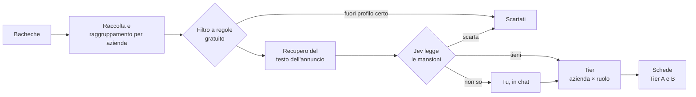

# JobHunter

*[Read in English](README.md)*

**Un archivio locale per la ricerca di lavoro che trasforma migliaia di annunci in una lista corta di aziende che valgono il tuo tempo.**

JobHunter raccoglie annunci da più bacheche, li raggruppa per azienda e fa passare ogni annuncio davanti a una catena di giudici, dalle regole gratuite a un modello che legge le mansioni. Quello che resta incerto arriva a te. Gira tutto sul tuo computer: profilo, archivio e decisioni non lo lasciano mai.

Sull'archivio dell'autore: 23.049 annunci da 5.908 aziende sono diventati 1.509 ruoli compatibili e 198 aziende da guardare per prime.

## Come funziona



- **Due domande separate.** L'azienda è interessante, cioè il suo settore ti interessa? Ha un ruolo adatto? Le due risposte si incrociano in un Tier solo alla fine, così un'azienda valida senza posizioni aperte resta sotto osservazione.
- **Prima il giudice più economico.** Le regole gratuite scartano ciò che è certo; il resto lo legge Jev, un modello che risponde a domande precise con probabilità. Una passata completa di Jev su 23.000 annunci costa circa 1,20 $.
- **Chi decide non scrive.** Jev decide e non scrive nulla; Qwen scrive le schede e non decide nulla.
- **L'ultima parola è tua.** Le tue decisioni, e le regole che confermi in chat, prevalgono su ogni verdetto automatico. Ogni verdetto conserva la sua prova, così vedi sempre perché un annuncio è finito dov'è.

## Avvio rapido

Serve Python 3.11 o successivo.

```bash
git clone https://github.com/ettoremodina/JobHunter.git
cd JobHunter
python -m venv .venv
.venv/Scripts/activate            # macOS/Linux: source .venv/bin/activate
pip install -r requirements.txt
playwright install chromium
python main.py init
python main.py serve
```

`init` crea il database e i tuoi file personali a partire dagli esempi inventati in `examples/`. La dashboard si apre su <http://127.0.0.1:8000>.

Poi rendi tuo il profilo, in uno di questi due modi:

- segui la [guida di avvio](docs/getting-started.it.md);
- chiedi al tuo agente di programmazione (Codex, Claude Code…) di seguire [skills/jobhunter-setup/SKILL.md](skills/jobhunter-setup/SKILL.md): ti fa qualche domanda e scrive profilo, filtri e ricerche.

Le chiavi API per Jev e Qwen sono facoltative e vanno in `.env.local`.

## Documentazione

| Da qui si parte | |
|---|---|
| [Primi passi](docs/getting-started.it.md) · [English](docs/getting-started.md) | Installazione, profilo, filtri, primo avvio |
| [Panoramica illustrata](docs/jobhunter-overview.html) | Tutto il sistema in diagrammi, in italiano e in inglese. Scaricala e aprila nel browser. |

| Per approfondire | |
|---|---|
| [DESIGN.md](DESIGN.md) | Decisioni di prodotto e invarianti della pipeline |
| [Pipeline completa](docs/pipeline-completa.md) | Un annuncio e un'azienda lungo tutti i passaggi |
| [Jev](docs/system-one.md) · [Schede](docs/remote-llm.md) | I due modelli: contratti, costi e cache |
| [Configurazione](docs/configuration.md) · [Fonti](docs/scraper-sources.md) | I file di configurazione, e come aggiungere una bacheca |
| [Revisione in chat](docs/conversazioni-codex.md) | Rivedere i ruoli incerti ed esplorare la selezione con un agente |
| [Mappa del codice](docs/mappa-codice-dati.md) · [Modello dati](docs/data-model.md) | Dove vive ogni responsabilità |
| [docs/README.md](docs/README.md) | L'indice completo |

## Struttura della repository

```text
jobhunter/     il pacchetto Python: raccolta, valutazione, operazioni, server della dashboard
dashboard/     la dashboard web locale (HTML, CSS e JS semplici)
config/        configurazione condivisa: fonti, settori, geografia, modelli, soglie
examples/      file personali di esempio che `init` copia al loro posto
skills/        skill per agenti: configurazione guidata e revisione in chat
docs/          documentazione
tests/         test unitari e controlli nel browser
main.py        il punto d'ingresso da riga di comando (python main.py --help)
```

## Test

Dopo `python main.py init`:

```bash
python -B -m unittest discover -s tests -v
```

## I tuoi dati restano locali

Profilo, filtri, ricerche, chiavi API (`.env.local`) e archivio (`data/`) sono elencati in `.gitignore` e non lasciano mai il tuo computer. Prima di pubblicare un fork, controlla `git status`.
