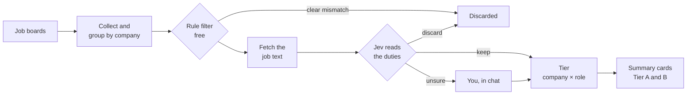

# JobHunter

*[Leggi in italiano](README.it.md)*

**A local job-hunting archive that turns thousands of job ads into a short list of companies worth your time.**

JobHunter collects job ads from several boards, groups them by company, and runs every ad past a chain of judges, from free rules to a model that reads the duties. Whatever stays uncertain comes to you. Everything runs on your computer: your profile, your archive and your decisions never leave it.

On the author's archive: 23,049 ads from 5,908 companies became 1,509 compatible roles and 198 companies to look at first.

## How it works



- **Two separate questions.** Is the company interesting (its sector)? Does it have a fitting role? The two answers are combined into a Tier only at the end, so a good company without open roles stays on your radar.
- **Cheapest judge first.** Free rules discard what is certain; Jev, a model that answers typed questions with probabilities, reads the rest. A full Jev run over 23,000 ads costs about $1.20.
- **Deciding and writing are separate.** Jev decides and writes nothing; Qwen writes summary cards and decides nothing.
- **You have the last word.** Your decisions, and the rules you confirm in chat, override every automatic verdict. Every verdict keeps its evidence, so you can always see why an ad ended up where it is.

## Quick start

You need Python 3.11+.

```bash
git clone https://github.com/ettoremodina/JobHunter.git
cd JobHunter
python -m venv .venv
.venv/Scripts/activate            # macOS/Linux: source .venv/bin/activate
pip install -r requirements.txt
playwright install chromium
python main.py init
python main.py serve
```

`init` creates the database and your personal files from the fictional examples in `examples/`. The dashboard opens at <http://127.0.0.1:8000>.

Next, make the profile yours. Either:

- follow the [getting-started guide](docs/getting-started.md), or
- ask your coding agent (Codex, Claude Code…) to follow [skills/jobhunter-setup/SKILL.md](skills/jobhunter-setup/SKILL.md): it interviews you and writes your profile, filters and searches.

API keys for Jev and Qwen are optional and go in `.env.local`.

## Documentation

| Start here | |
|---|---|
| [Getting started](docs/getting-started.md) · [italiano](docs/getting-started.it.md) | Install, write your profile, set the filters, first run |
| [Illustrated overview](docs/jobhunter-overview.html) | The whole system in diagrams, English and Italian. Download it and open it in a browser. |

| Go deeper (in Italian) | |
|---|---|
| [DESIGN.md](DESIGN.md) | Product decisions and pipeline invariants |
| [Full pipeline](docs/pipeline-completa.md) | One ad and one company through every step |
| [Jev](docs/system-one.md) · [Summary cards](docs/remote-llm.md) | The two models, their contracts, costs and caches |
| [Configuration](docs/configuration.md) · [Sources](docs/scraper-sources.md) | Config files, and how to add a job board |
| [Chat review](docs/conversazioni-codex.md) | Reviewing uncertain roles and exploring the shortlist with an agent |
| [Code and data map](docs/mappa-codice-dati.md) · [Data model](docs/data-model.md) | Where each responsibility lives |
| [docs/README.md](docs/README.md) | The full index |

The dashboard and the command-line messages are in Italian.

## Repository layout

```text
jobhunter/     the Python package: acquisition, evaluation, operations, dashboard server
dashboard/     the local web dashboard (plain HTML, CSS and JS)
config/        shared configuration: sources, sectors, geography, models, thresholds
examples/      fictional personal files that `init` copies into place
skills/        agent skills: guided setup and chat review
docs/          documentation
tests/         unit tests and browser checks
main.py        the command-line entry point (python main.py --help)
```

## Tests

After `python main.py init`:

```bash
python -B -m unittest discover -s tests -v
```

## Your data stays local

Your profile, filters, searches, API keys (`.env.local`) and archive (`data/`) are listed in `.gitignore` and never leave your computer. Before pushing a fork, check `git status`.
