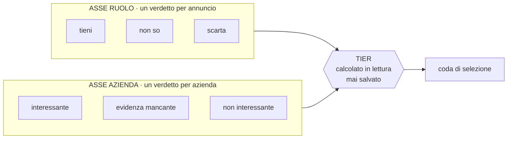
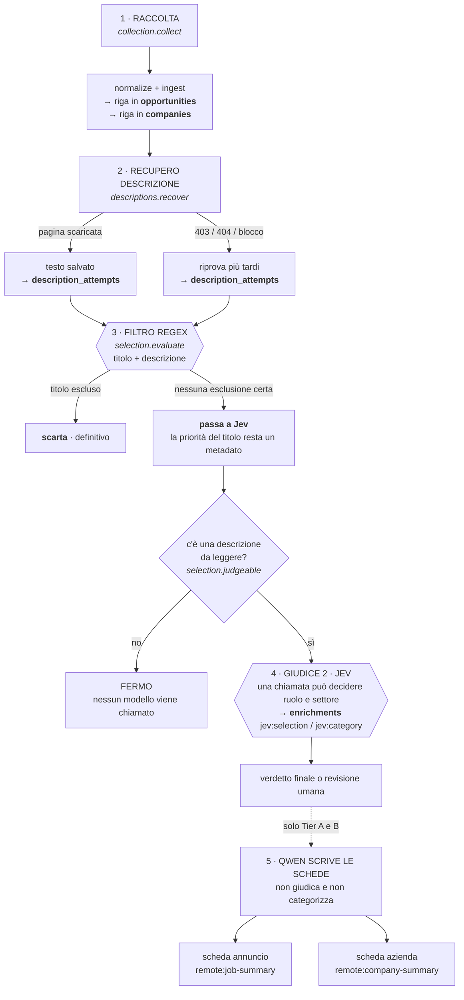
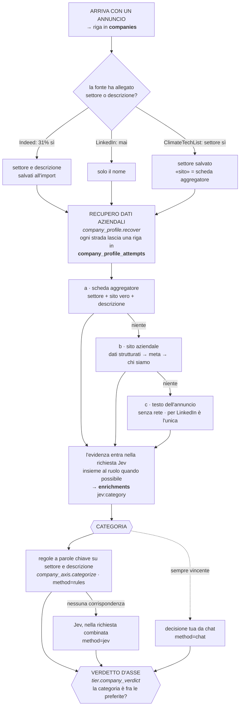
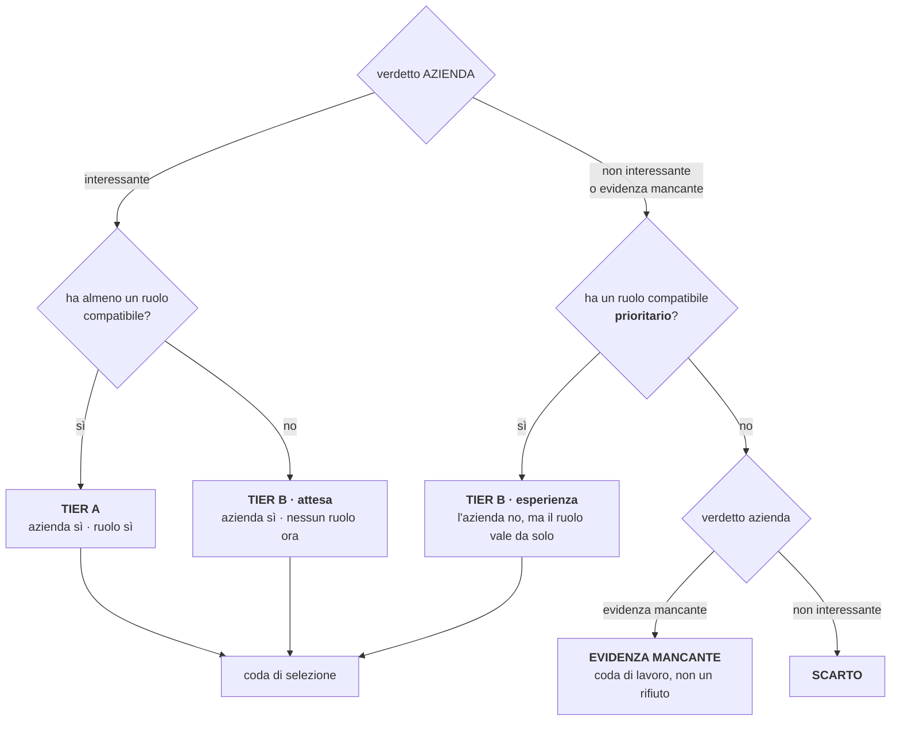

# La pipeline, passo per passo

Scritto il 10 settembre 2026. Che cosa succede a un annuncio e a un'azienda dal momento
in cui entrano in archivio, chi decide cosa, e dove resta scritto.

Complemento a [`DESIGN.md`](../DESIGN.md), [`data-model.md`](data-model.md) e
[`scraper-sources.md`](scraper-sources.md).

## Il principio: due assi che non si toccano

Il programma non decide «questo annuncio va bene». Decide due cose **separatamente**, e
solo alla fine le incrocia.



Perché separati: un'azienda interessante che oggi non ha ruoli adatti non va scartata, va
tenuta d'occhio. E un ruolo eccezionale in un'azienda fuori settore merita comunque di
essere visto. Un punteggio unico perderebbe entrambe le informazioni.

**Il tier non è mai salvato.** Si ricalcola a ogni lettura da `jobhunter/evaluation/tier.py`.
Salvarlo ricreerebbe il difetto originale: un'azienda finita a «scarto» non risalirebbe
mai quando pubblica un ruolo adatto.

---

## Il percorso di un annuncio



### Cosa fa ogni passaggio

**1 · Raccolta.** `normalize()` accetta più nomi per lo stesso campo perché ogni fonte usa
i suoi. Le differenze operative sono raccolte in [`scraper-sources.md`](scraper-sources.md). L'annuncio
finisce in `opportunities.data` come JSON, con un `content_hash` che è l'impronta del suo
contenuto. I dati aziendali vanno sulla riga azienda, mai sull'annuncio.

**2 · Recupero descrizione.** Le fonti danno il titolo ma spesso non il testo. `recover()`
va sulla pagina dell'annuncio e prova, in ordine: i dati strutturati `JobPosting`, il
contenitore pubblico di LinkedIn, il microdata di SmartRecruiters. Ogni tentativo lascia
una riga in `description_attempts` con lo stato e quando riprovare, così una passata
successiva non rifà quello che ha già funzionato e rispetta i blocchi della fonte.

Questo passaggio **non esclude nessuno**: decide solo con quanta evidenza l'annuncio verrà
giudicato.

**3 · Filtro regex.** Legge **solo l'annuncio**: il titolo con i pattern di
`config/role_filters.json`, la descrizione per anni di esperienza richiesti, gestione di
persone e requisiti di lingua. La descrizione dell'azienda non la guarda mai.

Può produrre un solo esito definitivo: **scarto**. Se non trova un'esclusione certa,
l'annuncio passa a Jev. Un titolo nella famiglia preferita conserva la priorità di carriera,
ma non diventa per questo compatibile: la compatibilità richiede la lettura delle mansioni.

Il suo esito sta in `search_eligibility`, che è una **cache pigra**: viene ricalcolata a
ogni lettura se il `content_hash` dell'annuncio o l'impronta delle regole sono cambiati.
Non è un passaggio da lanciare — lo step «Aggiorna filtri» della dashboard produce solo il
rapporto, il lavoro è già stato fatto.

Conseguenza importante: **i verdetti del regex si auto-correggono.** Arriva la descrizione,
cambia il `content_hash`, il verdetto si rifà da solo.

**Il filtro «c'è una descrizione?»** è il freno che protegge Jev. Dare a un
modello solo il titolo produce sempre `review`: il costo di una chiamata per nessuna
informazione nuova. Senza descrizione, l'annuncio resta fermo e in attesa — non respinto.

**4 · Giudice · System One (Jev).** Vede tutti gli annunci non scartati dal filtro regex che hanno un testo da
leggere. Fa **una richiesta combinata** per il ruolo e, quando serve, per il settore
dell'azienda. Non genera testo: risponde a domande tipizzate e
restituisce una probabilità per ognuna, quindi un giudizio mancante o una citazione fuori
catalogo non sono possibili. Le soglie che trasformano le probabilità in verdetto stanno in
`config/system_one.json`, le domande in `config/system-one-questions.json`. Le risposte
restano indipendenti e vengono salvate separatamente. Per l'azienda invia una domanda indipendente
per settore e conserva al massimo due categorie che superano le soglie configurate. Il settore
legge il **testo vero** degli annunci invece delle frasi che il regex lascia passare. Dettagli in
[docs/system-one.md](system-one.md).

**5 · Schede · Qwen.** Non giudica e non categorizza: è l'unico passaggio che
**scrive**, e scrive soltanto. **Una sola chiamata per azienda**, che porta insieme le schede
degli annunci compatibili di Tier A e B e la scheda aziendale. Il profilo e le etichette
stanno nel messaggio di sistema perché il provider possa metterlo in cache; il profilo qui
non seleziona niente, dice solo quali fatti vale la pena estrarre per chi leggerà la scheda.

Quello che System One lascia indeciso **resta indeciso**: nessun modello lo rivede. Esce dalla
pipeline automatica e diventa materiale per te.

Fra il regex e il remoto c'era già stato un giudice, un modello su Ollama, **rimosso il 10
settembre 2026**: decideva 0 ruoli su 4.918 e non toglieva lavoro al remoto (`DESIGN.md` §3).
System One occupa quel posto per un motivo diverso — non il costo, il formato della risposta.

La cascata è la regola: il filtro regex ferma soltanto le esclusioni certe; Jev giudica le
mansioni di tutti gli altri annunci leggibili. Dopo System One non c'è nessun altro giudice
automatico.

---

## Il percorso di un'azienda



**Categorizzare l'azienda *è* valutare l'asse.** Non c'è un giudizio separato: il verdetto
è la risposta a «la sua categoria sta in `preferred_categories`?». Se la categoria è «Da
classificare», il verdetto è `evidenza_mancante` — che è una coda di lavoro, non un
rifiuto.

**Chi ha scritto la categoria conta.** Il campo `categories.method` dice se è arrivata
dalle regole, da Jev o da te in chat (`local_llm` resta soltanto su eventuali righe storiche
del giudice locale). Le regole non riscrivono mai il giudizio di Jev, e niente riscrive una
tua decisione da chat.

---

## Dove si incontrano: il tier



Le due soglie sull'asse ruolo sono diverse di proposito. Per un'azienda che già interessa
basta un ruolo compatibile qualsiasi. Per un'azienda che non interessa serve un ruolo
**prioritario** — la soglia più stretta di `primary_title_pattern`.

---

## Dove resta scritto cosa

| tabella | cosa conserva | chi la scrive |
|---|---|---|
| `opportunities` | l'annuncio come JSON, più `content_hash` | raccolta, recupero descrizione |
| `companies` | nome, sito, settore sorgente, descrizione, `description_provenance` | importazione, `company_profile` |
| `observations` | dove e quando quell'annuncio è stato visto | raccolta |
| `description_attempts` | esito del recupero **per annuncio**, con quando riprovare | `descriptions.recover` |
| `company_profile_attempts` | esito di **ogni strategia** provata per azienda, col testo grezzo | `company_profile.recover` |
| `search_eligibility` | esito del regex, invalidato da contenuto e regole | cache pigra, a ogni lettura |
| `categories` | fino a due categorie ordinate per azienda, confidenza, **metodo** e motivazione | regole, Jev, chat |
| `enrichments` | ogni risposta del modello remoto, con impronta dell'input e nome del modello | il passaggio remoto |
| `personal_queue` | le aziende pronte da rivedere adesso | `selection.queue` |
| `feedback` | le tue decisioni, annullabili | interfaccia |
| `pipeline_jobs`, `runs` | ogni esecuzione, con parametri ed esito | dashboard e CLI |

**Niente di calcolato viene salvato**: né il tier, né i verdetti d'asse, né la catena dei
giudici. Si ricostruiscono a ogni lettura da quello che i giudici hanno scritto in
`search_eligibility`, `enrichments` e `categories`.

---

## Come seguire un singolo annuncio

```bash
python main.py show <ID_AZIENDA>
```

Mostra l'azienda con i suoi annunci, il verdetto di ogni asse, la catena dei giudici con le
citazioni, e la provenienza della descrizione aziendale.

Per la traccia grezza:

| domanda | dove guardare |
|---|---|
| il testo dell'annuncio è stato scaricato? | `description_attempts` |
| che cosa ha deciso il regex e perché | `search_eligibility.decision` |
| quale modello ha giudicato e con che prova | `enrichments`, task `jev:selection` |
| da dove viene la descrizione dell'azienda | `companies.description_provenance` |
| quali strade sono state provate su quell'azienda | `company_profile_attempts` |
| chi ha messo quella categoria | `categories.method` |

---

## L'ordine in cui girano

La sequenza della dashboard è: **raccolta → filtri → descrizioni → remoto → coda**.

Ogni passaggio è indipendente e ripetibile. `pipeline_jobs` registra l'impronta degli input
al momento in cui è girato, così la dashboard può dire «da rifare» quando qualcosa è
cambiato sotto.

`company-profile` oggi **non è nella sequenza**: si lancia solo da riga di comando.
Collegarlo è lavoro aperto.
